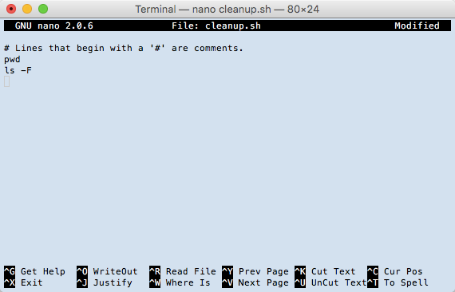

We are finally ready to see what makes the shell such a powerful programming environment.
We are going to take the commands we repeat frequently and save them in files
so that we can re-run all those operations again later by typing a single command.
For historical reasons,
a bunch of commands saved in a file is usually called a **shell script**,
but make no mistake:
these are actually small programs.

Let's start by going back to `data-shell/` and creating a new file, `cleanup.sh` which will
become the shell script:

~~~
$ cd data-shell
$ nano cleanup.sh
~~~
{: .language-bash}

The command `nano cleanup.sh` opens the file `cleanup.sh` within the text editor "nano"
(which runs within the shell).
If the file does not exist, it will be created.

> ## Which Editor?
>
> When we say, "`nano` is a text editor," we really do mean "text": it can
> only work with plain character data, not tables, images, or any other
> human-friendly media. We use it in examples because it is one of the 
> least complex text editors. However, because of this trait, it may 
> not be powerful enough or flexible enough for the work you need to do
> after this workshop. On Unix systems (such as Linux and Mac OS X),
> many programmers use [Emacs](http://www.gnu.org/software/emacs/) or
> [Vim](http://www.vim.org/) (both of which require more time to learn), 
> or a graphical editor such as
> [Gedit](http://projects.gnome.org/gedit/). On Windows, you may wish to
> use [Notepad++](http://notepad-plus-plus.org/).  Windows also has a built-in
> editor called `notepad` that can be run from the command line in the same
> way as `nano` for the purposes of this lesson.  
>
> No matter what editor you use, you will need to know where it searches
> for and saves files. If you start it from the shell, it will (probably)
> use your current working directory as its default location. If you use
> your computer's start menu, it may want to save files in your desktop or
> documents directory instead. You can change this by navigating to
> another directory the first time you "Save As..."
{: .callout}

We can use the text editor to directly edit the file -- we'll simply insert the following lines:

~~~
# Lines that begin with a '#' are comments.
pwd
ls -F
~~~
{: .source}

These commands are not going to modify anything yet;
they simply print the path of the working directory and list the files in it.
Remember, we are *not* running it as a command just yet;
we are putting the commands in a file.

> ## Comments
>
> A comment starts with a `#` character and runs to the end of the line.
> The computer ignores comments,
> but they're invaluable for helping people (including your future self) understand and use scripts.
> The only caveat is that each time you modify the script,
> you should check that the comment is still accurate:
> an explanation that sends the reader in the wrong direction is worse than none at all.
{: .callout}

Once we're happy with our text, we can press `Ctrl-O` (press the Ctrl or Control key and, while
holding it down, press the O key) to write our data to disk
(we'll be asked what file we want to save this to:
press Return to accept the suggested default of `cleanup.sh`).

Once our file is saved, we can use `Ctrl-X` to quit the editor and
return to the shell.

> ## Control, Ctrl, or ^ Key
>
> The Control key is also called the "Ctrl" key. There are various ways
> in which using the Control key may be described. For example, you may
> see an instruction to press the Control key and, while holding it down,
> press the X key, described as any of:
>
> * `Control-X`
> * `Control+X`
> * `Ctrl-X`
> * `Ctrl+X`
> * `^X`
> * `C-x`
>
> In nano, along the bottom of the screen you'll see `^G Get Help ^O WriteOut`.
> This means that you can use `Control-G` to get help and `Control-O` to save your
> file.
{: .callout}

`nano` doesn't leave any output on the screen after it exits,
but `ls` now shows that we have created a file called `cleanup.sh`:

~~~
$ ls cleanup.sh
~~~
{: .language-bash}

~~~
cleanup.sh
~~~
{: .output}

Now that we have saved the file,
we can ask the shell to execute the commands it contains.
Our shell is called `bash`, so we run the following command:

~~~
$ bash cleanup.sh
~~~
{: .language-bash}

~~~
/Users/nelle/Desktop/data-shell
cleanup.sh                fig_11_09.csv             habitat_03.jpg
data/                     fig_11_10.csv             humphrey_keeble_1976.pdf
fig_11_01.csv             finches_01.jpg            lab_notes/
fig_11_02.csv             finches_02.jpg            lab_notes.zip
fig_11_03.csv             finches_03.jpg            loewenberg_1965.pdf
fig_11_04.csv             finches_04.jpg            oldroyd_1984.pdf
fig_11_05.csv             greenleaf_et_al_1998.pdf  olsen_2017.pdf
fig_11_07.csv             habitat_01.jpg            readme for fig files.txt
fig_11_08.csv             habitat_02.jpg            van_leeuwen_2002.pdf
~~~
{: .output}

Sure enough,
our script's output is exactly what we would get if we ran those commands directly.

Let's start making things happen with the script.
In the script we're going to make a directory that we can move all the PDF files into.

~~~
$ nano cleanup.sh
~~~
{: .language-bash}

Add the following lines:

~~~
# Make a directory named pdfs.
mkdir pdfs
~~~
{: .source}

WriteOut and Exit from nano.

Now we can run the `cleanup.sh` script to see what it does.

~~~
$ bash cleanup.sh
~~~
{: .language-bash}

The output should be the same as before, but if we run the `ls` command we can see a new directory was created.

What happens if we run the script again?

~~~
$ bash cleanup.sh
~~~
{: .language-bash}

~~~
/Users/tkeswick/Desktop/data-shell
cleanup.sh                fig_11_10.csv             lab_notes/
data/                     finches_01.jpg            lab_notes.zip
fig_11_01.csv             finches_02.jpg            loewenberg_1965.pdf
fig_11_02.csv             finches_03.jpg            oldroyd_1984.pdf
fig_11_03.csv             finches_04.jpg            olsen_2017.pdf
fig_11_04.csv             greenleaf_et_al_1998.pdf  pdfs/
fig_11_05.csv             habitat_01.jpg            readme for fig files.txt
fig_11_07.csv             habitat_02.jpg            van_leeuwen_2002.pdf
fig_11_08.csv             habitat_03.jpg
fig_11_09.csv             humphrey_keeble_1976.pdf
mkdir: pdfs: File exists
~~~
{: .output}

You'll notice the last line of the output contains an notice: `mkdir: pdfs: File exists`

There is no need to worry about this notice; it is not an error, just something to take note of.
It happens because in the first run of the script the `pdfs` directory is created.
During the second and any subsequent runs of the script, the directory already exists.
In the future you can learn how to take care of situations like this with conditionals,
but that is a more advanced technique for another lesson.

> ## Moving Files
>
> What command would you add to the script in order to move
> all the PDF files into the `pdfs` directory?
>
> > ## Solution
>>  We'll want to use the `mv` command and select our files with a wildcard.
>>
>> ~~~
>> mv *.pdf pdfs/
>> ~~~
>> {: .language-bash}
>>
>> The first argument for the `mv` command selects all the files that end in `.pdf` 
>> and the second argument is the destination for those files: the `pdfs` directory.
> {: .solution}
{: .challenge}

> ## Deleting Files
>
> What command would you add to the script in order to delete
> the `lab_notes` directory?
>
> > ## Solution
>>  We'll want to use the `rm` command with the `-r` flag to remove the directory.
>>
>> ~~~
>> rm -r lab_notes
>> ~~~
>> {: .language-bash}
>>
>> The `-r` flag indicates that we want to remove files and directories recursively.
> {: .solution}
{: .challenge}
